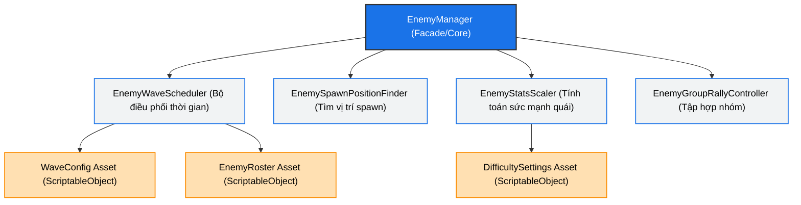

# Đề Xuất Thiết Kế Lại EnemyManager (EnemyManager Redesign Proposal)

Tài liệu này phân tích các hạn chế của `EnemyManager` hiện tại và đề xuất một cấu trúc modular mới, dễ quản lý, dễ mở rộng và cho phép thiết kế Wave trực tiếp từ Unity Editor thông qua ScriptableObject mà không cần chỉnh sửa mã nguồn.

---

## 1. Các hạn chế của thiết kế hiện tại

Hiện tại, [EnemyManager.cs](file:///f:/Unity/Cloud%20Terrace%20Realm%20dev/Assets/Scripts/Managers/EnemyManager.cs) là một lớp nguyên khối (Monolithic) dài hơn 1300 dòng và đang đảm nhận quá nhiều trách nhiệm:
1. **Quản lý dữ liệu Wave (Hardcoded Data)**: Các wave Đêm 1, 2, 3, 5 được viết cứng trong code (`CreatePresetWaveConfig`), khiến Game Designer không thể thay đổi thông số trực tiếp trong Unity Inspector.
2. **Cơ chế Spawn thông minh (Spawn Selection)**: Trực tiếp tính toán tọa độ rìa bản đồ, khoảng cách camera, và kiểm tra NavMesh.
3. **Cơ chế Tập hợp Nhóm (Group Rally)**: Tính toán Rally Point và chạy Coroutine theo dõi thời gian chờ đợi/tỷ lệ lính tập hợp.
4. **Cân bằng & Tăng tiến Sức mạnh (Stats Scaling)**: Tính toán lượng máu, sát thương, tốc độ tăng thêm của quái sau mỗi đêm.
5. **Theo dõi Trạng thái (Event & Active Tracking)**: Lắng nghe sự kiện đổi ngày đêm, dọn dẹp danh sách quái chết, và kích hoạt các sự kiện đột kích ngày mưa.

> [!IMPORTANT]
> Việc tích tụ tất cả logic này vào một file làm tăng nguy cơ phát sinh lỗi khi sửa đổi, khó viết Unit Test, và cản trở việc thiết kế màn chơi linh hoạt.

---

## 2. Kiến Trúc Mới Đề Xuất (Modular Architecture)

Chúng ta sẽ tách `EnemyManager` thành một hệ thống bao gồm một **Facade** duy nhất duy trì API cũ (để không làm hỏng code hiện tại) kết hợp với các **ScriptableObjects** lưu trữ dữ liệu và các **Sub-modules** xử lý logic chuyên biệt.



### Chi tiết phân chia module:

| Tên Module / File | Vai trò & Nhiệm vụ chính |
| :--- | :--- |
| **EnemyManager.cs** (Facade) | - Đóng vai trò là Singleton `EnemyManager.Instance` để các hệ thống khác gọi tới.<br>- Chứa danh sách `_activeEnemies` và xử lý dọn dẹp quái đã chết.<br>- Nhận sự kiện từ `TimeManager` và phân phối xuống các module con. |
| **EnemyWaveScheduler.cs** | - Lập lịch và kiểm tra thời gian (`timeRatio`) để kích hoạt đợt spawn.<br>- Đọc dữ liệu từ `WaveConfig` hoặc tự động sinh wave ngẫu nhiên dựa trên `EnemyRoster` đã unlock theo ngày. |
| **EnemySpawnPositionFinder.cs** | - Xử lý hình học: tìm các cạnh rìa (North, South, East, West).<br>- Chạy thuật toán chấm điểm candidate để chọn vị trí thông minh (né camera, cách xa nhà chính). |
| **EnemyStatsScaler.cs** | - Quản lý nhân hệ số thuộc tính quái vật theo sự tăng tiến của đêm.<br>- Áp dụng chỉ số bonus đặc biệt (Trăng máu, ngày mưa). |
| **EnemyGroupRallyController.cs** | - Nhóm các quái vật mới spawn lại thành một tiểu đội.<br>- Cho chúng di chuyển đến Rally Point tạm thời và chạy Coroutine giám sát khi nào nhóm đã sẵn sàng để tấn công. |

---

## 3. Chuyển đổi dữ liệu sang ScriptableObject

Thay vì khai báo các cấu trúc dữ liệu (`EnemyWaveEntry`, `DayWaveConfig`) và danh sách thô trong code, chúng ta sẽ tạo các ScriptableObject.

### 3.1. `EnemyRosterData.cs` (Quản lý các loại quái được unlock)
Dùng để cấu hình danh sách quái vật có thể xuất hiện trong game, bao gồm ngày unlock và tỉ lệ xuất hiện (weight).
```csharp
[CreateAssetMenu(fileName = "EnemyRoster", menuName = "Enemy/Roster Data")]
public class EnemyRosterData : ScriptableObject
{
    public List<EnemyRosterEntry> roster = new List<EnemyRosterEntry>();
}
```

### 3.2. `WaveConfigData.cs` (Quản lý thiết kế màn chơi/wave cụ thể)
Cho phép Game Designer tự tạo ra các file asset dạng `.asset` đại diện cho các wave cụ thể của từng đêm (ví dụ: `Night1_Intro.asset`, `Night5_BloodMoon.asset`).
```csharp
[CreateAssetMenu(fileName = "WaveConfig", menuName = "Enemy/Wave Config")]
public class WaveConfigData : ScriptableObject
{
    public string waveName = "Midnight Raid";
    public int specificNight = 0; // Đêm áp dụng (0 = mặc định)
    [Range(0.5f, 0.99f)] public float spawnTimeRatio = 0.75f;
    public float countMultiplier = 1f;
    public List<EnemyWaveEntry> enemies = new List<EnemyWaveEntry>();
}
```

### 3.3. `DifficultySettings.cs` (Quản lý tăng tiến độ khó)
Lưu các tham số tăng trưởng chỉ số của quái vật theo đêm.
```csharp
[CreateAssetMenu(fileName = "DifficultySettings", menuName = "Enemy/Difficulty Settings")]
public class DifficultySettings : ScriptableObject
{
    [Header("Base Scaling")]
    public int baseEnemyCount = 3;
    public int enemyIncreasePerNight = 2;
    public int maxEnemiesPerWave = 30;
    
    [Header("Post Tutorial Growth (Night 10+)")]
    public int enemyScalingStartNight = 10;
    public float healthGrowthPerNight = 0.03f;
    public float damageGrowthPerNight = 0.02f;
    public float speedGrowthPerNight = 0.01f;
}
```

---

## 4. Các lợi ích đạt được sau khi thiết kế lại

1. **Clean Code & Dễ Bảo Trì**: Mỗi file C# chỉ dài từ 100 - 300 dòng thay vì 1300 dòng. Lỗi phát sinh ở phần nào (ví dụ: lỗi chọn vị trí spawn) chỉ cần debug ở file con tương ứng.
2. **Thân Thiện Với Game Designer**: Không cần biết lập trình vẫn có thể tạo thêm các loại quái mới, tăng/giảm tỉ lệ spawn, tạo wave riêng cho Đêm 10, Đêm 20 chỉ bằng cách tạo các file Asset trong thư mục dự án và kéo thả trong Inspector.
3. **Tránh Xung Đột Git (Merge Conflicts)**: Khi lập trình viên sửa code AI và game designer thay đổi chỉ số cân bằng, họ sẽ làm việc trên các file khác nhau thay vì sửa chung một file `EnemyManager.cs`.

---

## 5. Các bước triển khai dự kiến

> [!NOTE]
> Để tránh gây lỗi biên dịch cho các class khác đang gọi `EnemyManager`, chúng ta sẽ giữ nguyên tên lớp `EnemyManager` và các thuộc tính public, nhưng thay đổi phần ruột bên trong để ủy quyền (delegate) việc xử lý cho các class mới.

1. **Bước 1**: Tạo các ScriptableObjects định nghĩa cấu trúc dữ liệu (`EnemyRosterData`, `WaveConfigData`, `DifficultySettings`).
2. **Bước 2**: Di chuyển logic tính toán tọa độ spawn sang lớp phụ trợ `EnemySpawnPositionFinder`.
3. **Bước 3**: Di chuyển logic tính hệ số chỉ số sang `EnemyStatsScaler`.
4. **Bước 4**: Tách logic điều phối wave và lập lịch sang `EnemyWaveScheduler`.
5. **Bước 5**: Tách logic quản lý nhóm và di chuyển đến điểm tập kết sang `EnemyGroupRallyController`.
6. **Bước 6**: Cập nhật lại `EnemyManager` để liên kết tất cả các module này và chạy thử nghiệm.
